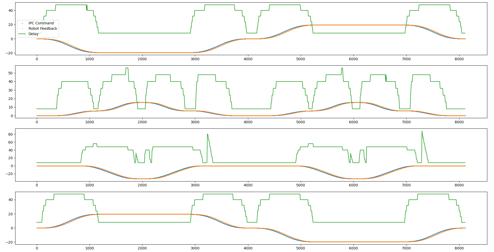
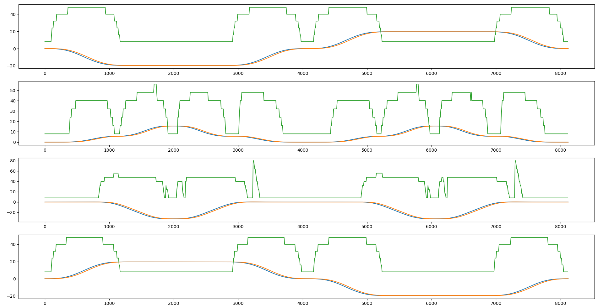
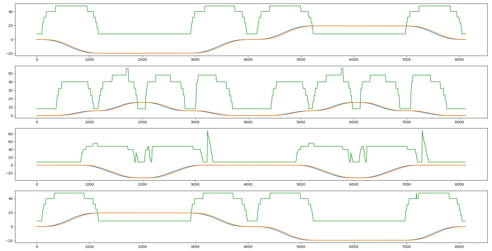
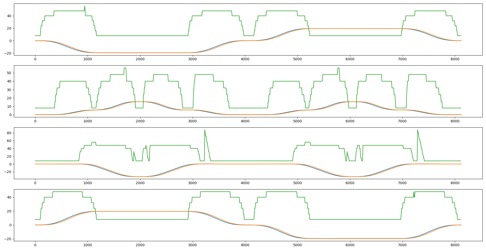
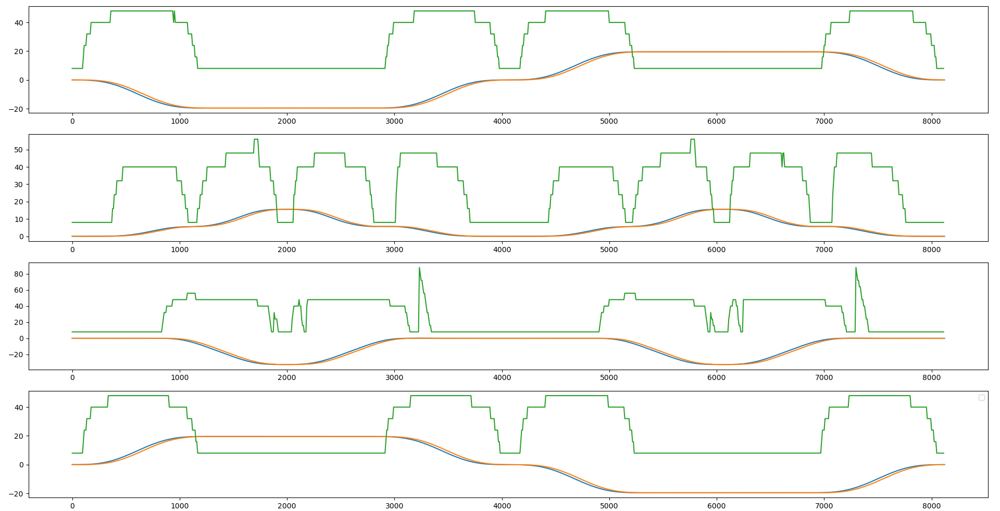

# Robot Execution Delay Analysis

Num of tests: 5.

Horizontal Axis: Time (ms).

Blue: IPC Command (deg).

Orange: Robot Feedback (deg).

Green: Delay time (ms).

## Observations: 
1. There is error between the robot execution and the position command. Thus, the delay is calculated using the closest point the robot reaches.
2. In general, it takes 48ms (6 steps) for the robot to arrive at the position command sent from IPC.
3. The delay could be shorter/longer as the robot decelerates/accelerates.
 

