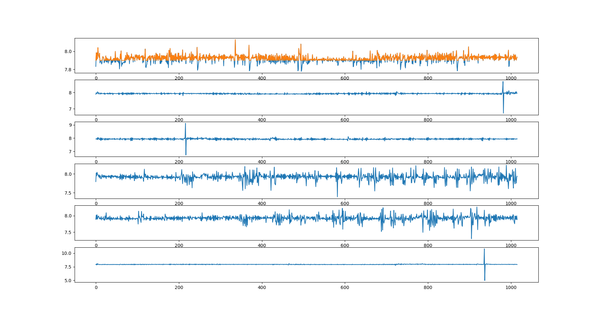

# Receive Time Profile Analysis

Num of tests: 6.

Table Unit: ms.

## Time Roundup Test

|  | Avg | Max | Min |
| --- | ----------- | ----------- | ----------- |
| Before Buffer | 7.920 | 8.130 | 7.779 |
| After Buffer (7.9ms) | 7.928 | 8.130 | 7.900 |

## Regular Test
| Trial | Avg | Max | Min |
| --- | ----------- | ----------- | ----------- |
| 1 | 7.930 | 8.673 | 6.735 |
| 2 | 7.930 | 9.113 | 6.728 |
| 3 | 7.917 | 8.234 | 7.391 |
| 4 | 7.922 | 8.268 | 7.298 |
| 5 | 7.931 | 10.796 | 4.963 |

Horizontal Axis: Timestep. 

Vertical Axis: Echo time in ms.

The orange plot in the first plot has a time buffer of 7.9ms (i.e., no matter how fast the echo arrives, wait for 7.9ms and then send the command).

The rest plots are regular executions (i.e., sending command immediately after receiving the echo).

